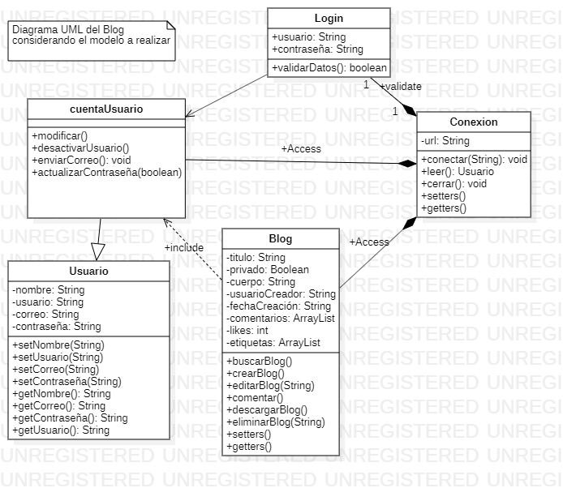

# **BLOG APP**


- [**BLOG APP**](#blog-app)
  - [**INTEGRANTES**](#integrantes)
  - [**¿CÓMO EJECUTAR?**](#cómo-ejecutar)
    - [**PASOS PARA INSTALAR PYTHON**](#pasos-para-instalar-python)
      - [**PARA WINDOWS O MacOS**](#para-windows-o-macos)
      - [**PARA LINUX/UNIX**](#para-linuxunix)
    - [**PASOS PARA INSTALAR FLASK**](#pasos-para-instalar-flask)
  - [**DIAGRAMA UML**](#diagrama-uml)
  - [**CASOS DE USO**](#casos-de-uso)

## **INTEGRANTES**

GRUPO A

- Daniel Velasquez Vasquez
- Daniela Sanchez Villegas
- Daniel Aguirre Salamanca
- Luis Eduardo Donoso
- Javier Santiago Borbón

## **¿CÓMO EJECUTAR?**

Para que este código funcione se debe tener instalado en el sistema Python 3, y del microframe conocido como Flask, si usted dispone de esto, podrá hacer uso de nuestra plataforma, de lo contrario siga las siguientes indicaciones:

REQUISITOS MÍNIMOS DEL SISTEMA:

- Se debe contar con un dispositivo Windows (posterior a XP), Linux/UNIX o MacOS.

- Poseer al menos de 100 Mb de espacio disponible (25 Mb del instalador y 90 Mb para funcionar).

### **PASOS PARA INSTALAR PYTHON**

#### **PARA WINDOWS O MacOS**

1. Ir al área de descargas para [Windows](https://www.python.org/downloads/windows/) o para [MacOS](https://www.python.org/downloads/mac-osx/) del sitio oficial y descargar el instalador ejecutable Python 3.8 de 32 o 64 bit.

2. Iniciar la instalación ejecutando el archivo (con privilegios) descargado Python-3.8.3. Si es necesario, confirmar la ejecución en la ventana de advertencia de seguridad de Abrir archivo.

3. Una vez iniciado el instalador, en la ventana Install Python 3.8.3 (64 bit) activar las casillas de las opciones: Install launcher for all users (recommended) y Add Python 3.8 to PATH. Después, continuar seleccionando la opción Customize installation. Choose Location and features.

4. Seguir las indicaciones del instalador.

5. En la ventana Setup was successful, una vez que ha concluido el proceso de instalación hacer clic en el botón [Close]. Desde esta ventana es posible acceder a un tutorial online de Python, a la documentación oficial del lenguaje y a información con las novedades de la presente versión.

#### **PARA LINUX/UNIX**

1. Verifique si su distribución viene con python preinstalado, para saber esto utilice el comando:

¿Tiene python inferior a 3?

```
$ python --version
```

o
¿Tiene python 3?

```
$ python3 --version
```

1. Si su respuesta a ambas preguntas no fue satisfactorio o si no posee Python 2 versión 2.7+, Python 3 versión 3.4+ o una versión posterior, siga los pasos a continuación dependiendo de la versión del SO que disponga, si no conoce que versión posee ejecute el siguiente comando:

```
$ cat /etc/*version
```

En derivados de Debian, como por ejemplo Ubuntu, use apt:

```
$ sudo apt-get install python3
```

En Red Hat y sus derivados, use yum:

```
$ sudo yum install python3
```

En SUSE y sus derivados, use zypper:

```
$ sudo zypper install python3
```

3. Abra la terminal y ejecute el siguiente comando para verificar que Python está instalado correctamente.

```
$ python3 --version
```

### **PASOS PARA INSTALAR FLASK**

1. Para poder utilizar Flask debes de tener, al menos, Python 2.6 instalado. Flask también funciona con Python 3.
2. Para instalar Flask vamos a utilizar pip. Así que simplemente deberemos de escribir en nuestra línea de comandos lo siguiente:

```
$ pip install Flask
```

Puede ser que para la instalación necesites ser administrador. En ese caso ejecuta:

```
 $ sudo pip install Flask
```

---

## **DIAGRAMA UML**



### **CASOS DE USO**


